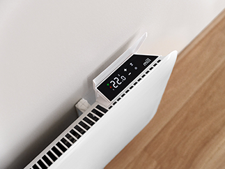
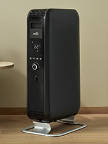
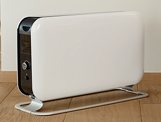
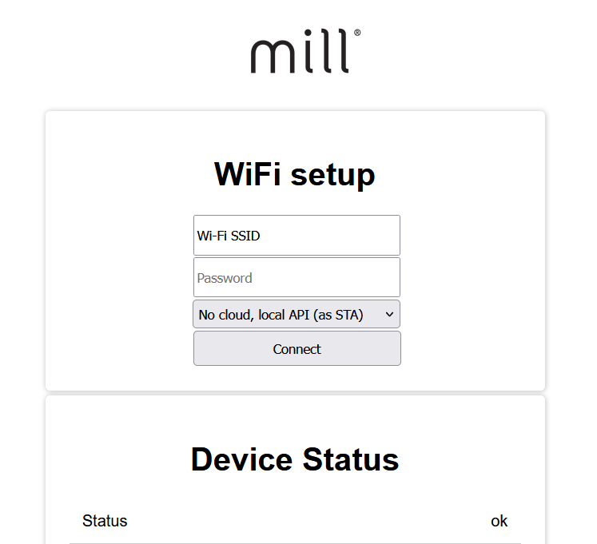
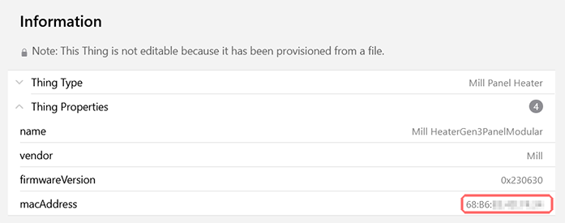

# Mill LAN Binding

This binding integrates generation 3 [Mill devices](https://millnorway.com/) with [openHAB](https://www.openhab.org/) using the local network only.
This is achieved by communicating with the REST API that is exposed by generation 3 devices via HTTP or HTTPS, using the local Wi-Fi network.
To control Mill devices using "the cloud", use the official [Millheat binding](https://github.com/openhab/openhab-addons/tree/main/bundles/org.openhab.binding.millheat) instead.



## Supported Things

This binding aims to support all Mill devices that have a local REST API.
According to Mill's documentation, this applies to:

* Panel heaters - Generation 3.
* Convection heaters - Generation 3.
* Oil heaters - Generation 3.
* Wi-Fi Socket - Generation 3.

Only panel heaters have been tested this far, anyone having access to one of the other device types and wants to help test and adapt this binding, please create a new [Issue](https://github.com/Nadahar/Mill-LAN-openHAB-Binding/issues).
There is a special `Thing-Type` called "All Functions" in this binding that exposes all implemented API endpoints to make it easy to see what works for any particular device.

## Configuring Wi-Fi on the Mill device

#### **Warning**: Regardless of which method you use to configure Wi-Fi on the device, you will **lose access** to the device if you mess up the configuration by for example registering the wrong SSID or forgetting to enter some information. Also note that for this binding to work, `local API` *must* be enabled. If you know how to enter "Access Point mode" you can repeat that procedure and try again, but if not, you will have to factory reset the device and use the mobile application to configure it from scratch. Making sure that you enter the correct information in the first place can save you time and frustration.

If you contact Mill support, they will tell you that to configure it for your Wi-Fi network you must install their mobile application and use that, in combination with Bluetooth, to configure the device. 
This also requires you to register with Mill.

Luckily for those of us that don't want our every move to be registered, this isn't true if your device has "Access Point mode" and you can figure out how to enable it. The documentation is sparse at best, and the exact procedure might vary between models. For some panel heaters, all that's needed is to enter the "settings menu" on the device and select the `AP` option.

Once the device is in "Access Point mode", you can use any mobile device or computer with Wi-Fi and a web browser to configure the Mill device.
You will need to search for Wi-Fi networks, and you should find a network called Mill something that is unsecured/open.
Connect to that network, and your web browser will either open a new page automatically, or you must enter the address in the browser manually by typing `http://192.168.4.1`.

This should bring you to the device configuration page, where you can enter the SSID and password for your local Wi-Fi network. Make sure that the local API is enabled as well, and press `Connect`.



After a factory reset of the device, this procedure must be repeated.

## Discovery

Automatic discovery using mDNS is available for panel heaters once the device is connected to the local Wi-Fi network.
For other device types, some diagnostic data is needed for the binding to implement automatic discovery.
Please get in contact if you have one of these.

If automatic discovery isn't yet available or for some reason doesn't work for a device, the Thing can be created manually if you know the IP address of the device.
There are many ways to find the IP address, but most require some knowledge of networking.
The easiest way for most people is via the router.
Almost all home routers run a DHCP server that automatically assigns IP addresses to devices that connect.
You can usually find an overview over what is called DHCP leases in the router, which typically shows the name, IP address and MAC address for all devices currently known by the DHCP server.
You can find the IP address in that overview by figuring out which one is your Mill device.

To avoid repeated discovery For file-based Things, the property `macAddress` must be defined in the form `68:B6:XX:XX:XX:XX`.
The easiest way to find the MAC address of the device is to configure the Thing without the MAC address, start openHAB, and then copy the value from the Thing overview in the UI:



For managed Things, this will be handled automatically, and no action is needed.

## Binding configuration

No binding configuration is necessary.

## Thing configuration

### `hostname` (required)

The binding only needs the IP address to be able to connect to the device.
As explained above, this can usually be found in your router if automatic discovery isn't an option.
Alternatively, a host name can be used if the local network has name resolution, but that's rare.

Mill has chosen not to offer manual IP address configuration, so a DHCP server is required for the devices to work.
A DHCP server will assign addresses from a configured range of IP addresses.
This means that the device might not get the same address every time it starts, which would make the connection from the binding fail.
Most DHCP servers allow you to make what's called a "reservation", which makes it possible to make sure that a specific device is always assigned the same IP address.
This is done by registering the device's MAC address and the assigned IP address as a reservation in the DHCP server.
The IP address should normally be _outside_ the defined dynamic range the DHCP server uses.

Some knowledge of networking is required to understand IP address ranges, but there are lots of online "calculators" that can help you find a valid range.
Usually though, home routers use a 254 address range by default, often `192.168.0.1` to `192.168.0.254` or similar.
If the DHCP server's dynamic range is defined as `192.168.0.20` to `192.168.0.200`, any unused IP addresses in the range below or above can be used for a reservation.
The router _usually_ has the first IP address in the range, `192.168.0.1` in the example above, but this is merely a convention and might not always be the case.

### `refreshInterval` and `infrequentRefreshInterval`

In addition to the IP address, you can define two different refresh intervals and an optional API key.
The "regular" refresh interval only queries the device for information that is likely to change relatively often, like temperature, power use etc.
The _infrequent_ refresh interval queries the device for much more information, information that is unlikely to change without human interaction.
If some "infrequent" settings are changed using the binding, they will be updated immediately independent of the refresh interval, so the "refresh" is only needed to pick up changes done through other means.
The reason for separating the two is to limit the amount of unnecessary network traffic.
These can both be set as low as one second if you don't care about network traffic and want "instant updates".

### `apiKey`

It is also possible to configure an API key.
If an API key has been configured in the device, the same API key must be configured in the binding, or the device will refuse to talk to the binding.
The Mill devices don't have an API key set by default, but one can be set with an Action from the binding.
Please note, that once an API key has been set, it cannot be "unset" again.
It can be changed as long as you know the current API key, but you need to perform a factory reset of the device to get it back to not having an API key.
When an API key has been set, the device will also switch from HTTP to HTTPS, so that all communication between the device and the binding is encrypted.
This makes the device a bit slower to respond, but shouldn't be a problem in most cases.

_Please note that if you set an API key and forget or lose it, there is no other way to regain access to the device but to do perform a factory reset, which means that the Wi-Fi configuration must be done again._

### Thing configuration parameter definitions

| Name            | Type    | Description                           | Default | Required | Advanced |
|-----------------|---------|---------------------------------------|---------|----------|----------|
| hostname        | text    | Hostname or IP address of the device  | N/A     | yes      | no       |
| refreshInterval | integer | Interval the device is polled in sec. | 60      | no       | no       |
| infrequentRefreshInterval | integer | Interval the device is polled in sec. | 300      | no       | no       |
| apiKey        | text    | API key to access the device         | N/A     | no      | no       |

There are other configuration parameters, but they are created dynamically after the binding has connected to a device.
These aren't Thing configurations, they configure the device itself, and the settings are stored in the device.

## Channels

| Channel | Type   | Read/Write | Description                 |
|---------|--------|:----------:|-----------------------------|
| ambient-temperature | Number:Temperature | R | The temperature measured by the device sensor corrected by the calibration offset |
| raw-ambient-temperature | Number:Temperature | R | The temperature measured by the device sensor without any offset |
| current-power | Number:Power | R | The power the device is currently using to produce heat |
| control-signal | Number:Dimensionless | R | The current control signal of the PID regulator (0-100%) |
| lock-status | String | R | The current lock status |
| open-window-status | String | R | The "open window" status |
| set-temperature | Number:Temperature | R | The current target temperature the device is working towards, cannot be set directly |
| connected-to-cloud | Switch | R | Whether the device is currently connected to the cloud |
| operation-mode | String | RW | The current mode of operation |
| temperature-calibration-offset | Number:Temperature | RW | The calibration offset value |
| commercial-lock | Switch | RW | The status of the commercial-lock |
| child-lock | Switch | RW | The status of the child-lock |
| display-unit | String | RW | The temperature unit ("Celsius" or "Fahrenheit") displayed on the device |
| normal-set-temperature | Number:Temperature | RW |The "normal" set-temperature value |
| comfort-set-temperature | Number:Temperature | RW |The "comfort" set-temperature value |
| sleep-set-temperature | Number:Temperature | RW |The "sleep" set-temperature value |
| away-set-temperature | Number:Temperature | RW |The "away" set-temperature value |
| limited-heating-power | Dimmer | RW | The maximum heating power limit in percent (10-100%) |
| controller-type | String | RW | The regulator controller type |
| predictive-heating-type | String | RW | The predictive heating type |
| oil-heater-power | Number:Dimensionless | RW | The maximum heating power in percent (40%, 60%, 100%) |
| open-window-active | Switch | R | Whether the open window function is active right now |
| open-window-enabled | Switch | RW | Whether the open window function is enabled |

## Actions

### `sendReboot`

Reboots the Mill device.

### `setTimeZoneOffset`

Sets the device time zone offset from UTC in minutes.

| Parameter | Type   | Description |
|-----------|--------|-------------|
| `offset` | Integer | The offset from UTC in minutes |

### `setPIDParameters`

Sets the PID parameters for the heating controller (panel heaters only).

| Parameter | Type   | Description |
|-----------|--------|-------------|
| `kp` | Double | The proportional gain factor |
| `ki` | Double | The integral gain factor |
| `kd` | Double | The derivative gain factor |
| `kdFilterN` | Double | The derivative filter time coefficient |
| `windupLimitPct` | Double | The wind-up limit for the integral part in percent |

### `setCloudCommunication`

Sets whether cloud communication is enabled for the device. Changing this will reboot the device.

| Parameter | Type   | Description |
|-----------|--------|-------------|
| `enabled` | Boolean | The new cloud communication setting |

### `setHysteresisParameters`

Sets the hysteresis parameters for the heating controller (not for panel heaters).

| Parameter | Type   | Description |
|-----------|--------|-------------|
| `upper` | Double | The upper limit: Set temperature + upper limit = stop heating |
| `lower` | Double | The lower limit: Set temperature - lower limit = start heating |

### `setIndependentModeTemperature`

Sets the "Independent Mode" target temperature. Fails if the device is in a different mode.

| Parameter | Type   | Description |
|-----------|--------|-------------|
| `temperature` | Double | The target temperature to set in °C. Special values 0 and 99 means "Off" and "Always On" respectively |

### `setCustomName`

Sets the custom name in the device.

| Parameter | Type   | Description |
|-----------|--------|-------------|
| `customName` | String | The new custom device name (maximum 32 characters) or blank to remove the existing custom name |

### `setOpenWindowParameters`

Sets the parameters for the open window function.

| Parameter | Type   | Description |
|-----------|--------|-------------|
| `dropTempThr` | Double | The temperature drop in °C required to trigger (activate) the open window function |
| `dropTimeRange` | Integer | The time range in seconds for which a drop in temperature will be evaluated |
| `incTempThr` | Double | The temperature increase in °C required to deactivate the open window function |
| `incTimeRange` | Integer | The time range in seconds for which an increase in temperature will be evaluated |
| `maxTime` | Integer | The maximum time in seconds the open window function will remain active |

### `setAPIKey`

Sets a new API key in the device.

**Warning:** Once an API key has been set, it cannot be "unset" again!
The device will change the API protocol from HTTP to HTTPS, which is encrypted but slower.
The only way to get the device back to using HTTP is to do a factory reset, which will also reset Wi-Fi settings and any other device configuration. It is possible to change the API key after it has been set, but not to remove it.

| Parameter | Type   | Description |
|-----------|--------|-------------|
| `apiKey` | String | The new API key, which cannot be blank or longer than 63 characters |
| `confirm` | String | To confirm that you really want to change the API key, enter the **last section of the Thing UID** in this field |

## Example configuration

### Thing configuration

Example `mill.things`:

```java
Thing milllan:panel-heater:<id> "Mill Panel Heater" @ "Living room" [
    hostname="192.168.0.201",
    apiKey="<secret key>",
    refreshInterval=20,
    infrequentRefreshInterval=120
] {}
```

### Item configuration

Example `mill.items`:

```java
Number:Temperature AmbientTemperature "Ambient Temperature" <temperature> ["Measurement", "Temperature"] {channel="milllan:panel-heater:id:ambient-temperature", unit="°C", stateDescription=" "[ pattern="%.1f %unit%" ] }
Number:Temperature RawAmbientTemperature "Raw Ambient Temperature" <temperature> ["Measurement", "Temperature"] {channel="milllan:panel-heater:id:raw-ambient-temperature", unit="°C", stateDescription=" "[ pattern="%.1f %unit%" ] }
Number:Power CurrentPower "Current Power" <energy> ["Measurement", "Power"] {channel="milllan:panel-heater:id:current-power", stateDescription=" "[ pattern="%.0f %unit%" ] }
Number:Dimensionless ControlSignal "Current Control Signal" <heating> ["Status"] {channel="milllan:panel-heater:id:control-signal", unit="%", stateDescription=" "[ pattern="%.0f %%" ] }
String LockStatus "Lock Status" <lock> ["Status"] {channel="milllan:panel-heater:id:lock-status"}
String OpenWindowStatus "Open Window Status" <window> ["Status"] {channel="milllan:panel-heater:id:open-window-status"}
Switch OpenWindowActive "Open Window Active" <window> ["Status"] {channel="milllan:panel-heater:id:open-window-active"}
Switch OpenWindowEnabled "Open Window Function" <window> ["Switch"] {channel="milllan:panel-heater:id:open-window-enabled"}
Number:Temperature SetTemperature "Set Temperature" <temperature> ["Status", "Temperature"] {channel="milllan:panel-heater:id:set-temperature", stateDescription=" "[ pattern="%.1f %unit%" ] }
Switch ConnectedToCloud "Connected to Cloud" ["Status"] {channel="milllan:panel-heater:id:connected-to-cloud"}
String OperationMode "Operation Mode" ["Control"] {channel="milllan:panel-heater:id:operation-mode"}
Number:Temperature TemperatureCalibrationOffset "Temperature Calibration Offset" <temperature> ["Setpoint", "Temperature"] {channel="milllan:panel-heater:id:temperature-calibration-offset", unit="°C", stateDescription=" "[ pattern="%.1f %unit%" ] }
Switch CommercialLock "Commercial Lock Status" <lock> ["Switch"] {channel="milllan:panel-heater:id:commercial-lock"}
Switch ChildLock "Child Lock Status" <lock> ["Switch"] {channel="milllan:panel-heater:id:child-lock"}
String DisplayUnit "Display Unit" ["Control"] {channel="milllan:panel-heater:id:display-unit"}
Number:Temperature NormalSetTemperature "Normal Set Temperature" <temperature> ["Setpoint", "Temperature"] {channel="milllan:panel-heater:id:normal-set-temperature", unit="°C", stateDescription=" "[ pattern="%.1f %unit%" ] }
Number:Temperature ComfortSetTemperature "Comfort Set Temperature" <temperature> ["Setpoint", "Temperature"] {channel="milllan:panel-heater:id:comfort-set-temperature", unit="°C", stateDescription=" "[ pattern="%.1f %unit%" ] }
Number:Temperature SleepSetTemperature "Sleep Set Temperature" <temperature> ["Setpoint", "Temperature"] {channel="milllan:panel-heater:id:sleep-set-temperature", unit="°C", stateDescription=" "[ pattern="%.1f %unit%" ] }
Number:Temperature AwaySetTemperature "Away Set Temperature" <temperature> ["Setpoint", "Temperature"] {channel="milllan:panel-heater:id:away-set-temperature", unit="°C", stateDescription=" "[ pattern="%.1f %unit%" ] }
Dimmer LimitedHeatingPower "Max Heating Power" <heating> ["Control"] {channel="milllan:panel-heater:id:limited-heating-power", unit="%", stateDescription=" "[ pattern="%.0f %%" ] }
String ControllerType "Controller Type" ["Control"] {channel="milllan:panel-heater:id:controller-type"}
String PredictiveHeatingType "Predictive Heating Type" ["Control"] {channel="milllan:panel-heater:id:predictive-heating-type"}
Number:Dimensionless OilHeaterPower "Oil Heating Power" <heating> ["Control"] {channel="milllan:panel-heater:id:oil-heater-power", unit="%", stateDescription=" "[ pattern="%.0f %%" ] }
```
